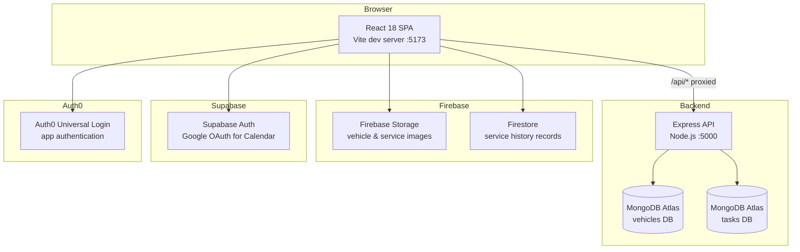

# Design Document: Auto Sentry Completion

## Overview

Auto Sentry is a full-stack vehicle maintenance tracker. The backend (Express + MongoDB Atlas) and the core React page structure are already in place. This document covers the technical design for completing the application across five milestones: security hardening, UX completion, content and code quality, testing baseline, and accessibility.

The work is entirely remediation and completion — no new backend services, no architectural rewrites, no new shared component libraries. Every change follows the existing file/folder structure and existing library choices.

### Design Goals

1. Eliminate all hardcoded credentials from source files.
2. Make every advertised feature actually work.
3. Drive UI updates through React state, never `location.reload()`.
4. Establish a test baseline (Vitest + RTL frontend, Jest + Supertest backend).
5. Meet basic WCAG 2.1 AA accessibility requirements for interactive elements.

---

## Architecture

The application is a standard client-server SPA.



### Key Architectural Decisions

**1. All credentials in environment variables**  
Backend reads `process.env.MONGO_URI` and `process.env.MONGO_TASKS_URI` via `dotenv`. Frontend reads `import.meta.env.VITE_AUTH0_DOMAIN`, `VITE_AUTH0_CLIENT_ID`, `VITE_FIREBASE_*`, `VITE_SUPABASE_URL`, and `VITE_SUPABASE_ANON_KEY`. A `.env.example` is committed; `.env` files are gitignored.

**2. Vite proxy eliminates hardcoded localhost URLs**  
`vite.config.js` proxies `/api` → `http://localhost:5000`. All frontend components use `/api/...` paths instead of `http://localhost:5000/api/...`.

**3. Auth0 is the sole authentication system**  
`LoginForm` and `SignupForm` pages become thin wrappers that call `loginWithRedirect()` (with `screen_hint: 'signup'` for the signup flow). The static form fields are removed. Auth0 Universal Login handles everything.

**4. State-driven UI updates**  
`location.reload()` is replaced with targeted `setState` calls everywhere: `TaskDashboard.handleTaskStatusChange` updates the task in the `tasks` array, `VehicleServiceHistory.handleClick` prepends the new record to `data`.

**5. Single ToastContainer at App root**  
`<ToastContainer />` lives only in `App.jsx`. All other instances in Garage, TaskDashboard, AddNew, GoogleCalender are removed. Components call `toast.*()` without owning the container.

**6. Vehicle model aligns with actual usage**  
`image: { data: Buffer, contentType: String }` → `image: String`. `vin: Number` → `vin: String`. This matches how the frontend has always treated these fields.

**7. No reorganization of file/folder structure**  
Pages stay under `src/pages/`, components under `src/components/`. New pages (404, Profile, Settings, Help) follow the existing per-folder pattern.

---

## Components and Interfaces

### Modified Components

#### `main.jsx`
- Replace hardcoded Supabase URL and anon key with `import.meta.env.VITE_SUPABASE_URL` and `import.meta.env.VITE_SUPABASE_ANON_KEY`.
- Replace hardcoded Auth0 `domain` and `clientId` with `import.meta.env.VITE_AUTH0_DOMAIN` and `import.meta.env.VITE_AUTH0_CLIENT_ID`.

#### `firebase.js`
- Replace all hardcoded Firebase config values with `import.meta.env.VITE_FIREBASE_*` variables.

#### `Historyconfig.js`
- Replace all hardcoded Firebase config values with the same `VITE_FIREBASE_*` set (both files point to different Firebase projects, so each gets its own env var prefix: `VITE_FIREBASE_STORAGE_*` and `VITE_FIREBASE_HISTORY_*`).

#### `backend/server.js`
- Add `require('dotenv').config()` at the top.
- Replace hardcoded MongoDB connection strings with `process.env.MONGO_URI` and `process.env.MONGO_TASKS_URI`.

#### `App.jsx`
- Move `<ToastContainer />` here, inside `<Router>` but outside `<Routes>`.
- Add routes: `<Route path="/profile" element={<Profile />} />`, `<Route path="/settings" element={<Settings />} />`, `<Route path="/help" element={<Help />} />`.
- Add catch-all: `<Route path="*" element={<NotFound />} />`.

#### `Navbar/index.jsx`
- Remove `<ToastContainer />` instance.
- Remove all `activeClassName` props; use the React Router v6 `className` callback: `className={({ isActive }) => isActive ? 'nav-link active' : 'nav-link'}`.
- Add `const [menuOpen, setMenuOpen] = useState(false)` for hamburger toggle.
- Add `onClick={() => setMenuOpen(prev => !prev)}` to `<FaBars>`, add `aria-label="Toggle navigation menu"` and `aria-expanded={menuOpen}`.
- Conditionally apply a CSS class to `.nav-menu` based on `menuOpen`.

#### `pages/Login/LoginForm.jsx`
- Remove static form fields.
- Replace with a simple page that calls `loginWithRedirect()` on button click.

#### `pages/SignUP/SignupForm.jsx`
- Fix import: `import './SignupForm.css'`.
- Replace static form with a button that calls `loginWithRedirect({ authorizationParams: { screen_hint: 'signup' } })`.

#### `pages/Garage/Garage.jsx`
- Remove duplicate `<ToastContainer />`.
- Add error state: `const [error, setError] = useState(null)` — set in `.catch()`, rendered inline.
- Add empty state: when `!loading && vehicles.length === 0`, render a prompt to add a first vehicle.
- Fix SVG: `fill-rule` → `fillRule`, `stroke-width` → `strokeWidth`.
- Delete button: change `<a>` to `<button>` with `aria-label="Delete vehicle"`.
- Remove `activeClassName` from NavLink elements.

#### `pages/Maintenance Tasks/TaskDashboard/TaskDashboard.jsx`
- Remove `<ToastContainer />`.
- Replace `location.reload()` in `handleTaskStatusChange` with a targeted state update: find the task by ID, set `taskStatus: true`, update the `tasks` array.
- Replace `fetch()` in `handleDeleteTask` with `axios.delete()`.
- Add error state — display inline on API failure.
- Add empty state for both upcoming and completed tabs.
- Calendar link: pass task name and due date as query params — `to={/Googlecalender?task=${encodeURIComponent(task.task)}&date=${task.dueDate}}`.
- Add `aria-label` to action icon buttons.
- Add loading state on form submit button.

#### `pages/Service History/VehicleServiceHistory.jsx`
- Replace `location.reload()` in `handleClick` with `setData(prev => [newRecord, ...prev])` where `newRecord` is constructed from `formData` plus the Firestore `id`.
- Add error state for Firebase failures.
- Add empty state when `data.length === 0`.
- Add loading state on submit button (disable during upload + write).
- Add delete handler: `handleDelete(id)` calls Firestore `deleteDoc`, then filters `data` by `id`.
- Add delete button per record with confirmation (`window.confirm` or inline confirm toggle).

#### `pages/GoogleCalender/GoogleCalender.jsx`
- Fix typo: remove `console.log(starst)` line.
- Replace `alert()` with `toast.error()`.
- Read query params via `useSearchParams` to pre-populate `eventName` and `start` date when navigating from TaskDashboard.

#### `components/Add New/addnew.jsx`
- Change VIN input type from `number` to `text` (matches the schema fix).
- Add loading state on submit button.
- All API calls already use axios — no change needed.

#### `components/Update Vehicle/updateVehicle.jsx`
- Rename file/folder to `UpdateVehicle/UpdateVehicle.jsx` and update all imports.
- Add loading state on submit.

#### `vite.config.js`
- Add server proxy:
```js
server: {
  proxy: {
    '/api': 'http://localhost:5000'
  }
}
```
- After this, all `http://localhost:5000/api/...` strings in frontend components become `/api/...`.

### New Pages

#### `pages/NotFound/NotFound.jsx`
Minimal 404 page with a link back to `/`. No CSS file needed — uses Tailwind classes or inline styles consistent with the app.

#### `pages/Profile/Profile.jsx`
Stub page: displays `user.name` and `user.email` from `useAuth0()`. Placeholder for future profile editing.

#### `pages/Settings/Settings.jsx`
Stub page: "Settings coming soon" with a back link.

#### `pages/Help/Help.jsx`
Stub page: brief FAQ or "coming soon" copy with a back link.

### Content Pages (Milestone 3)

#### `pages/About/About.jsx`
Replace Lorem Ipsum with Auto Sentry-specific content: product description, mission statement, and team section.

#### `pages/Services/Services.jsx`
Replace `<h1>` stub with a grid of service cards: Maintenance Tracking, Service History, Google Calendar Integration, Vehicle Garage.

#### `pages/Contact/Contact.jsx`
Replace `<h1>` stub with a contact form (name, email, message) with a `toast.success` on submit. No backend endpoint needed — form is static/demo.

#### `pages/Home/Home.jsx`
- Fix feature tile links: point to `/services`, `/garage`, `/Googlecalender`.
- Add `handleNewsletterSubmit` that validates email regex and calls `toast.success`.

---

## Data Models

### Vehicle (MongoDB — `vehicles` collection)

```js
{
  user:         { type: String, required: true },   // Auth0 user.nickname
  make:         { type: String, required: true },
  model:        { type: String, required: true },
  year:         { type: Number, required: true },
  modification: { type: String, required: true },
  vin:          { type: String, required: true },   // was Number — changed to String
  image:        { type: String, required: false },  // was Buffer object — changed to URL String
  timestamps:   true
}
```

**Rationale for changes:**
- `vin: Number` truncates leading zeros and cannot hold alphanumeric VINs. The 17-character VIN standard (ISO 3779) requires a string.
- `image: { data: Buffer, contentType: String }` was never used as binary — the frontend always stored a URL. Aligning the schema eliminates a type mismatch that would cause MongoDB validation errors on any document that was saved with the frontend's URL value.

### MaintenanceTask (MongoDB — `tasks` collection)

No schema changes required. Existing fields are correct.

```js
{
  user:            { type: String },
  vehicleId:       { type: String, required: true },
  task:            { type: String, required: true },
  priority:        { type: String, enum: ['High','Medium','Low'], default: 'Medium' },
  dueDate:         { type: Date, required: true },
  taskDescription: { type: String, required: true },
  taskStatus:      { type: Boolean, default: false },
  timestamps:      true
}
```

### Service History Record (Firestore — `txtData` collection)

Milestone 5 adds a `vehicleId` field. For Milestones 1–4 the structure is:

```js
{
  id:          string,   // Firestore document ID
  user:        string,   // Auth0 user.nickname
  service:     string,
  serviceDate: string,
  mileage:     string,
  cost:        string,
  description: string,
  image:       string    // Firebase Storage URL
}
```

Milestone 5 addition:
```js
vehicleId: string  // optional, for per-vehicle scoping
```

### Environment Variables

**Frontend — `frontend/Auto-Sentry/.env`** (gitignored):
```
VITE_AUTH0_DOMAIN=
VITE_AUTH0_CLIENT_ID=
VITE_FIREBASE_STORAGE_API_KEY=
VITE_FIREBASE_STORAGE_AUTH_DOMAIN=
VITE_FIREBASE_STORAGE_PROJECT_ID=
VITE_FIREBASE_STORAGE_BUCKET=
VITE_FIREBASE_STORAGE_MESSAGING_SENDER_ID=
VITE_FIREBASE_STORAGE_APP_ID=
VITE_FIREBASE_HISTORY_API_KEY=
VITE_FIREBASE_HISTORY_AUTH_DOMAIN=
VITE_FIREBASE_HISTORY_PROJECT_ID=
VITE_FIREBASE_HISTORY_BUCKET=
VITE_FIREBASE_HISTORY_MESSAGING_SENDER_ID=
VITE_FIREBASE_HISTORY_APP_ID=
VITE_SUPABASE_URL=
VITE_SUPABASE_ANON_KEY=
```

**Backend — `backend/.env`** (gitignored, already exists):
```
MONGO_URI=
MONGO_TASKS_URI=
```

---

## Correctness Properties

*A property is a characteristic or behavior that should hold true across all valid executions of a system — essentially, a formal statement about what the system should do. Properties serve as the bridge between human-readable specifications and machine-verifiable correctness guarantees.*

### Property 1: Vehicle schema round-trip

*For any* vehicle object with an alphanumeric VIN string and an image URL string, saving it to MongoDB and then fetching it back should return a document whose `vin` and `image` fields equal the original values without truncation or type coercion.

**Validates: Requirements 6.4**

---

### Property 2: Auth0 login wiring

*For any* render of the LoginForm or SignupForm page, clicking the primary action button should result in exactly one call to Auth0's `loginWithRedirect()`. For the SignupForm, the call must include `authorizationParams: { screen_hint: 'signup' }`.

**Validates: Requirements 7.1, 7.2**

---

### Property 3: Task status update via state

*For any* task list containing at least one pending task, calling the mark-complete handler on a pending task should move that task from the `upcomingTasks` list to the `completedTasks` list in component state, with no call to `location.reload()`.

**Validates: Requirements 7.3, 9.6**

---

### Property 4: Service history list update via state

*For any* initial service history list, successfully adding a new service record should result in that record appearing at the head of the displayed list in component state, with no call to `location.reload()`.

**Validates: Requirements 7.4**

---

### Property 5: Hamburger menu toggle

*For any* initial Navbar state, clicking the hamburger icon once should toggle the mobile menu from closed to open, and clicking it again should toggle it from open to closed.

**Validates: Requirements 7.7, 3.13**

---

### Property 6: Empty state rendering

*For any* authenticated user whose vehicle/task/service-history list is empty, the corresponding page (Garage, TaskDashboard, VehicleServiceHistory) should render a non-empty empty-state message element rather than a blank list.

**Validates: Requirements 7.8, 3.5, 3.6, 3.7**

---

### Property 7: Error state rendering

*For any* failed API or Firebase call in Garage, TaskDashboard, or VehicleServiceHistory, the component should render a user-visible error message element (not only a console.error call).

**Validates: Requirements 7.9, 3.8, 3.9, 3.10**

---

### Property 8: Submit button disabled during loading

*For any* form submission in AddNew, UpdateVehicle, or VehicleServiceHistory, while the async request is in flight, the submit button should have `disabled={true}`.

**Validates: Requirements 7.10, 3.14**

---

### Property 9: Home feature tile links are meaningful

*For any* rendered feature tile link on the Home page, the `href` (or React Router `to`) value should not be `'/'`. Each tile must point to a distinct, relevant route.

**Validates: Requirements 8.4, 4.4**

---

### Property 10: Newsletter email validation

*For any* string that matches a valid email regex submitted in the Home newsletter form, a success toast should be triggered. *For any* string that does not match a valid email regex, a success toast should not be triggered and the form state should be unchanged.

**Validates: Requirements 8.5, 4.5**

---

### Property 11: Garage renders correct vehicle count

*For any* API response containing N vehicles belonging to the authenticated user, the Garage component should render exactly N vehicle card elements.

**Validates: Requirements 9.3**

---

### Property 12: AddNew form payload correctness

*For any* valid vehicle form data object (make, model, year, modification, vin, image), submitting the AddNew form should result in a `POST /api/vehicles` call whose request body contains all those fields with their original values.

**Validates: Requirements 9.4**

---

### Property 13: Task tab routing by status

*For any* list of tasks with mixed `taskStatus` values, the Upcoming tab should contain exactly the subset where `taskStatus === false`, and the Completed tab should contain exactly the subset where `taskStatus === true`.

**Validates: Requirements 9.5**

---

### Property 14: POST /api/vehicles returns 400 on missing required field

*For any* vehicle creation request that omits one or more required fields (user, make, model, year, modification, vin), the API should return HTTP status 400.

**Validates: Requirements 9.7**

---

### Property 15: GET /api/tasks/byVehicle returns only matching tasks

*For any* `vehicleId` value, every task object returned by `GET /api/tasks/byVehicle/:vehicleId` should have a `vehicleId` field equal to the requested value.

**Validates: Requirements 9.9**

---

### Property 16: Service history add round-trip

*For any* valid service record object, adding it via the VehicleServiceHistory form and then calling `getData()` should return a list that includes a record with the same field values as the one added.

**Validates: Requirements 9.10**

---

### Property 17: Icon-only buttons have aria-label

*For any* interactive button in the app that contains only an icon (no visible text), the element should have a non-empty `aria-label` attribute.

**Validates: Requirements 10.2**

---

### Property 18: Dropdown closes on Escape

*For any* open Navbar dropdown or mobile menu, pressing the Escape key should result in the menu/dropdown being closed (i.e., no longer visible in the DOM or hidden via CSS class).

**Validates: Requirements 10.3**

---

### Property 19: Task priority has visible text label

*For any* task rendered in the TaskDashboard, the rendered element should contain visible text that identifies the priority level (one of "High", "Medium", "Low"), not relying on color alone.

**Validates: Requirements 10.4**

---

### Property 20: Service history delete round-trip

*For any* existing service record displayed in VehicleServiceHistory, clicking delete and confirming should result in that record no longer appearing in the rendered list.

**Validates: Requirements 10.5**

---

### Property 21: Calendar link encodes task data as query params

*For any* task rendered in the TaskDashboard, the calendar link's `to` prop should contain the task's `task` (name) and `dueDate` values as URL-encoded query parameters.

**Validates: Requirements 10.6**

---

## Error Handling

### Frontend

**API Failures (Garage, TaskDashboard)**
- Each component holds `const [error, setError] = useState(null)`.
- On axios `.catch()`, set the error state with a human-readable message.
- Render `{error && <p role="alert" className="error-msg">{error}</p>}` above the list.
- The error clears on the next successful fetch.

**Firebase Failures (VehicleServiceHistory)**
- Wrap `addDoc` / `getDocs` / `deleteDoc` calls in try/catch.
- On catch, set error state and call `toast.error()` for immediate feedback.

**Form Submissions**
- Each form holds `const [loading, setLoading] = useState(false)`.
- Set `loading = true` before the request, reset in `.finally()`.
- `<button type="submit" disabled={loading}>` prevents double-submission.
- On error, call `toast.error()` with the error message.

**Auth0 / Supabase**
- `LoginForm` / `SignupForm` catch `loginWithRedirect` errors and show `toast.error()`.
- `GoogleCalender` replaces `alert()` with `toast.error()` in the `googleSignIn` catch block.

**404 / Unknown Routes**
- React Router v6 catch-all `<Route path="*" element={<NotFound />} />` handles all unmatched paths.

### Backend

**Mongoose Validation Errors**
- Express route handlers already distinguish `error.name === 'ValidationError'` → 400. This pattern is extended to all routes.

**Not Found**
- `findById` returning `null` → 404 with `{ message: 'Not found' }`. Already implemented for vehicles and tasks; pattern is consistent.

**Internal Errors**
- All unhandled errors → 500 with `{ message: 'Internal server error' }`.

**Missing Environment Variables**
- If `MONGO_URI` or `MONGO_TASKS_URI` is undefined at startup, `mongoose.connect()` will throw. The existing `.catch()` logs the error and the process exits — acceptable behavior for a missing-env startup failure.

---

## Testing Strategy

### Overview

Both unit tests and property-based tests are used. Unit tests catch specific regressions and verify concrete behaviors. Property-based tests verify that behaviors hold across the space of valid inputs, catching edge cases that example-based tests miss.

### Frontend: Vitest + React Testing Library

**Setup additions to `package.json` devDependencies:**
```json
"vitest": "^1.x",
"@testing-library/react": "^14.x",
"@testing-library/jest-dom": "^6.x",
"@testing-library/user-event": "^14.x",
"fast-check": "^3.x",
"jsdom": "^24.x"
```

**`vitest.config.js` additions:**
```js
test: {
  environment: 'jsdom',
  setupFiles: ['./src/test/setup.ts'],
  globals: true
}
```

**Test file locations** follow the existing source structure: `src/pages/Garage/__tests__/Garage.test.jsx`, etc.

**Unit Tests (specific examples and edge cases):**
- `NotFound` renders when navigating to an unknown path (Req 7.5)
- `/profile`, `/settings`, `/help` routes render their stub pages (Req 7.6)
- `Garage` renders only one `<ToastContainer />` (Req 8.7)
- Vehicle card delete action uses a `<button>` element (Req 8.8)
- `Vehicle_Card` "Empty" button is absent (Req 8.12)
- Contact form renders input fields and a submit button (Req 8.3)
- Skip-nav link is the first focusable element in `App` (Req 10.1)

**Property-Based Tests (fast-check):**

Each test runs a minimum of 100 iterations. Comments reference the design property they validate.

| Test | Property | Req |
|---|---|---|
| Vehicle schema round-trip | P1 | 6.4 |
| Auth0 loginWithRedirect on LoginForm click | P2 | 7.1, 7.2 |
| Task complete moves task to completed list | P3 | 7.3 |
| Service history add updates displayed list | P4 | 7.4 |
| Hamburger toggles menu open/closed | P5 | 7.7 |
| Empty list → empty state message visible | P6 | 7.8 |
| API error → error message visible | P7 | 7.9 |
| Submit button disabled while loading | P8 | 7.10 |
| Home tile links not '/' | P9 | 8.4 |
| Newsletter: valid email → toast, invalid → no toast | P10 | 8.5 |
| Garage renders N cards for N vehicles | P11 | 9.3 |
| AddNew payload matches form data | P12 | 9.4 |
| Tasks appear in correct tab by status | P13 | 9.5 |
| Icon-only buttons have aria-label | P17 | 10.2 |
| Escape key closes dropdown | P18 | 10.3 |
| Task priority text is visible | P19 | 10.4 |
| Service history delete removes record | P20 | 10.5 |
| Calendar link has task name + date query params | P21 | 10.6 |

**Tag format for all property tests:**
```js
// Feature: auto-sentry-completion, Property N: <property_text>
```

### Backend: Jest + Supertest

**Setup additions to `backend/package.json` devDependencies:**
```json
"jest": "^29.x",
"supertest": "^6.x",
"mongodb-memory-server": "^9.x"
```

**`backend/package.json` scripts:**
```json
"test": "jest --runInBand",
"test:watch": "jest --watch"
```

**Test setup:** `mongodb-memory-server` spins up an in-memory MongoDB instance for each test suite, so no test data touches the Atlas cluster.

**Unit Tests (examples):**
- `DELETE /api/vehicles/deleteVehicle/:id` with valid ID → 200 (Req 9.8)

**Property-Based Tests (fast-check):**

| Test | Property | Req |
|---|---|---|
| POST /api/vehicles with missing required field → 400 | P14 | 9.7 |
| GET /api/tasks/byVehicle/:vehicleId returns only matching tasks | P15 | 9.9 |
| Service history add then fetch includes added record | P16 | 9.10 |

**Tag format:**
```js
// Feature: auto-sentry-completion, Property N: <property_text>
```

### Balance Note

Property-based tests cover the universal rules. Unit tests are reserved for concrete examples (specific routes, specific rendered elements) that are inherently single-case. No behavior is tested by both a property test and a unit test unless they exercise genuinely different aspects.
